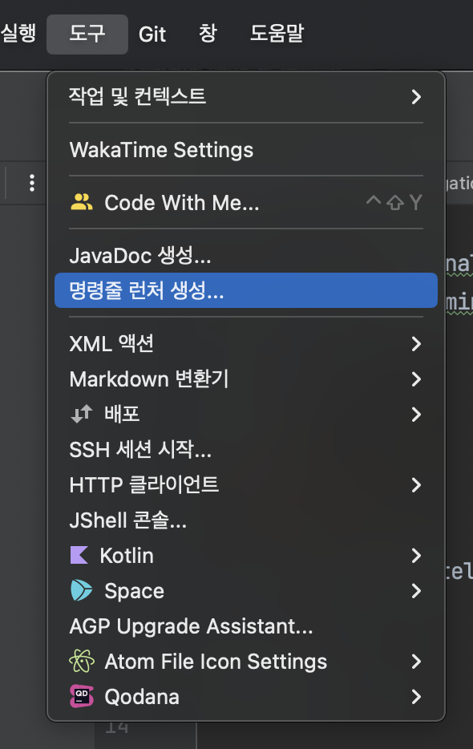

인텔리제이를 이용하여 프로젝트를 열면서 VSCODE에서는 터미널에서 `code .`으로 열 수 있었는데 인텔리제이에도 그런 기능이 있지 않을까 싶어서 찾아보았다.

먼저 인텔리제이를 실행한 뒤 아무 프로젝트나 열어준다. 

그리고 `Tools` -> `Create Command-line Launcher` 를 클릭한다.

아래와 같은 화면이 뜨면 그대로 ok를 눌러주는데, 뒤에 `idea`는 원하는거로 바꿀 수 있다.

이제 터미널에서 해당 프로젝트에 들어가서 `idea .` 명령어로 인텔리제이를 열 수 있다. 