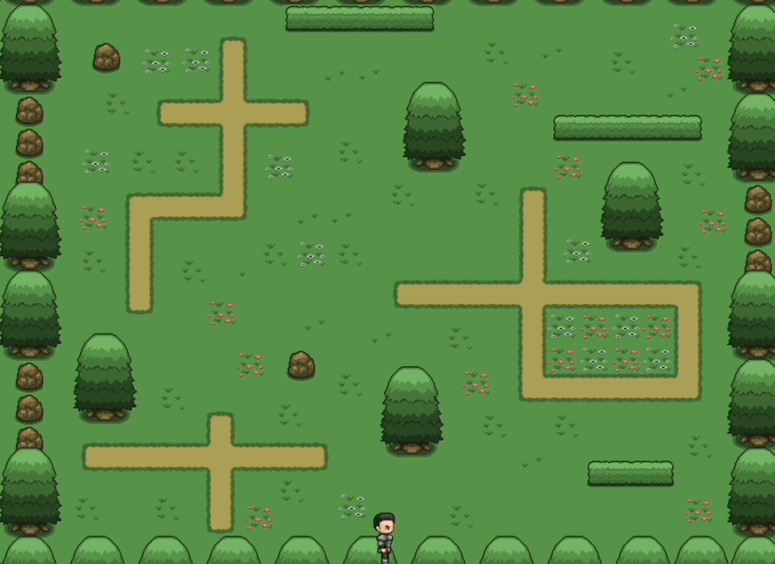

> 
 2022-07-17 ~ 2022-07-24 

---

위코드를 통해 개발자로의 새로운 삶을 시작했다.

1주차에는 프론트와 백엔드 구분 없이 html과 css 그리고 javascript 관련 replit 문제를 풀이하고

DOM과 event를 이용한 간단한 게임 만들기를 했으며,

컴퓨팅 사고를 기르는법, 개발자 도구 사용법 마지막으로 웹 서비스의 전반적인 역사와 흐름에 대하여 배웠다.

사전 스터디를 하면서 개발자 도구는 콘솔만 사용했었는데 정말 많은 기능이 있는것 같다고는 생각했지만 그 이상의 더 많은 기능들이 있어서

앞으로 틈만 나면 개발자 도구를 켜서 봐야겠다는 생각이 들었다.

1주차는 많이 어려운 부분은 없어서 금요일 정도에 다 끝내고 2주차를 준비했다.

2주차에는 본격적으로 프론트와 백엔드가 나뉘어지기 때문에 처음 맞이하는 백엔드의 세계에 긴장도 되고 설레기도 한다.

---
