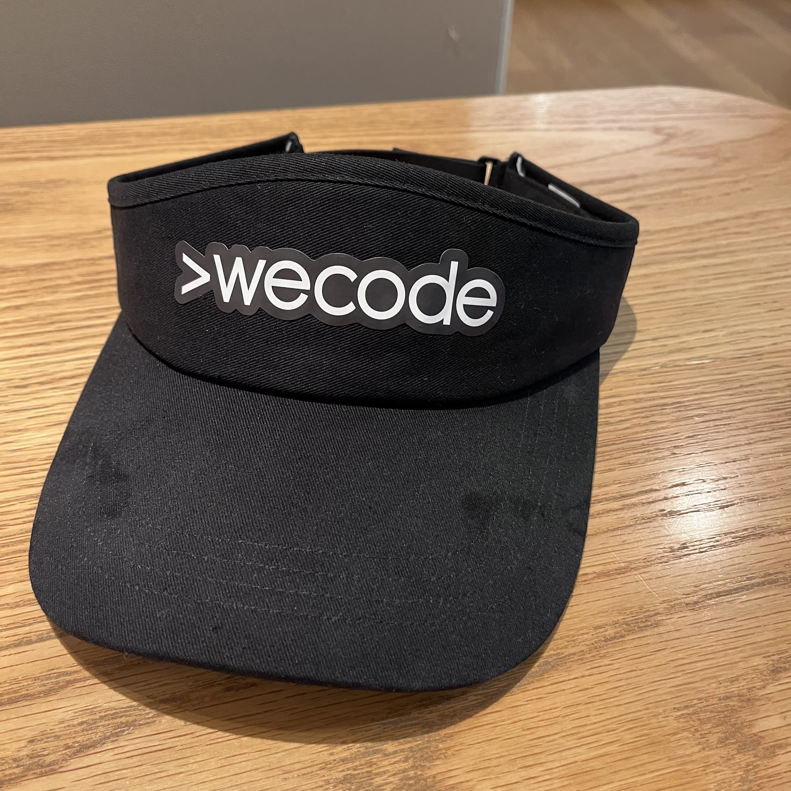

> 
 2022-08-01 ~ 2022-08-07 

---

위코드 3주차에는 두명이서 짝을 지어서 한명은 드라이버가 되고 한명은 네비게이터가 되어 함께 알고리즘 문제를 풀이하는 코드카타 시간이 매일 한시간 씩 있었다.

문제를 해결하면 더 좋지만 그것보다 해결하는 과정에 중심을 둔 시간이었다.

한명은 네비게이터가 되어 내가 생각한 풀이법을 드라이버에게 전달하고 드라이버는 네비게이터가 말해준대로 코드를 작성하는 것이다.

그동안 문제를 해결하면서 '이렇게 하면 될거같다.', '저렇게 하면 될거같다.', '구글에 검색해보니 이렇게 하더라' 라는 생각으로 코드를 작성했던것이 많았는데 그러다보니 지금까지 코드를 작성하면서 왜 그렇게 작성했는지 이유와 근거를 대기가 힘들었다.

코드카타 시간을 통해 나의 문제가 무엇인지 파악할 수 있게 되었고 지금은 코드 하나 하나에도 의미를 가지고 작성하려고 노력하고있다.

다만 지금은 시간적 여유가 많이 없다보니 아직 이해하지 못하고 넘어가는 부분도 많고 그로인해 뒤에 흐름이 깨지는 일이 많긴 하지만 그래도 앞으로 공부해나갈 방법 중 하나를 알게 되었으니 이렇게 코드 하나 하나에 의미를 찾으려고 노력한다면 일년 이년 삼년 뒤에는 정말 탄탄한 밑거름이 되어 줄 것이라 생각한다.

그리고 3주차에 백엔드는 MySQL과 Express, typeorm, cors, nodemon, morgan, dotenv, layered pattern에 대하여 공부하고 프로젝트를 수행했다.

데이터베이스에 테이블을 만들고 데이터를 입력하고 수정하고 했는데 처음에는 수십개가 넘는 데이터를 직접 타이핑해서 넣느라고 고생했다. 프로그램을 이용할 수도 있었지만, 쿼리문에 익숙해지기 위해서 조금 노가다를 해봤는데 쿼리문이랑 조금 친해진 것 같고 다 만들어진 테이블을 보니 뿌듯했다.

그러고 나서 이전에 만들었던 http 모듈만을 이용했던 유저와 게시글에 대한 작업을 express를 이용해서 다시 한번 만들어 보는 것이었다.

express를 이용해서 만들어보면서 정말 백줄 이백줄에 달하던 기능 하나가 express를 이용하니 길어야 이삼십줄로 끝나는 것을 보고 너무 멋지다라고 생각했고 다른 한편으론 처음부터 express로 시작했으면 아무런 원리도 모르고 그저 'express로 api를 찍어내는 기계가 되었을 수도 있겠다.' 라는 생각이 들었다.

부트캠프 입장에서 한정된 시간안에 가르쳐야되고 취업률이 곧 그 회사의 결과일텐데 바로 모듈 사용으로 넘어가지 않고 원리부터 차근 차근 가르치는 모습이 정말 인상적이었다.

---

### 번외

이번 주에 자리를 바꿨는데 바로 위에 전등이 있어서 눈이 너무 피로해져서 썬캡을 하나 구매했다. 그냥 쓰기 심심해서 위코드에서 받은 스티커를 붙였는데 너무 찰떡이다 ㅎㅎ 새로운 굿즈가 생겼다.
