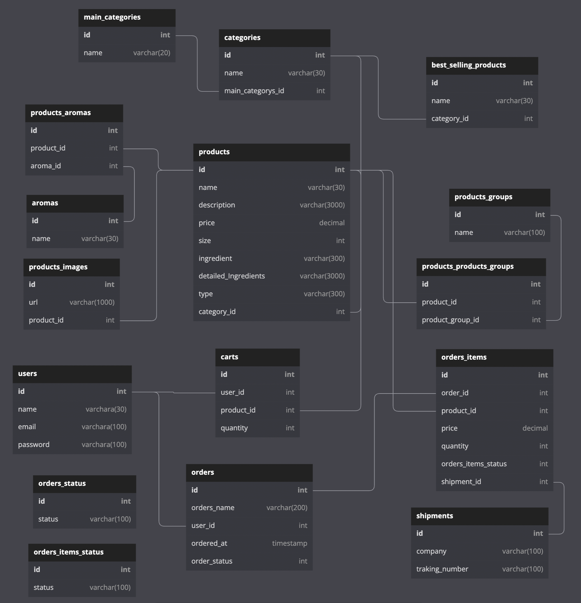
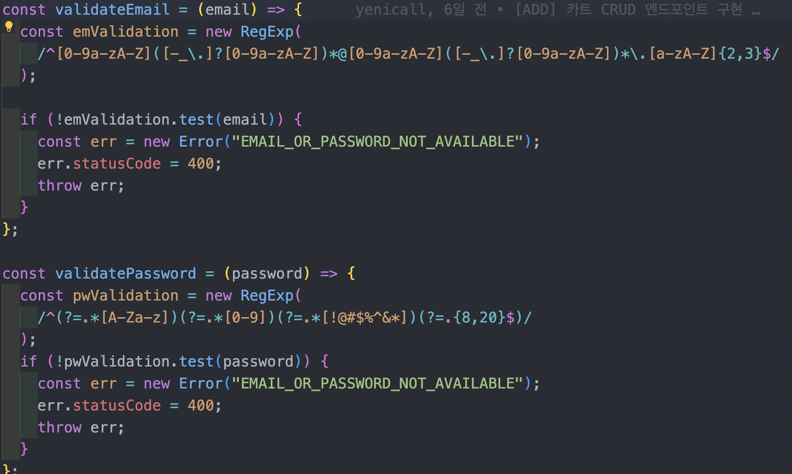
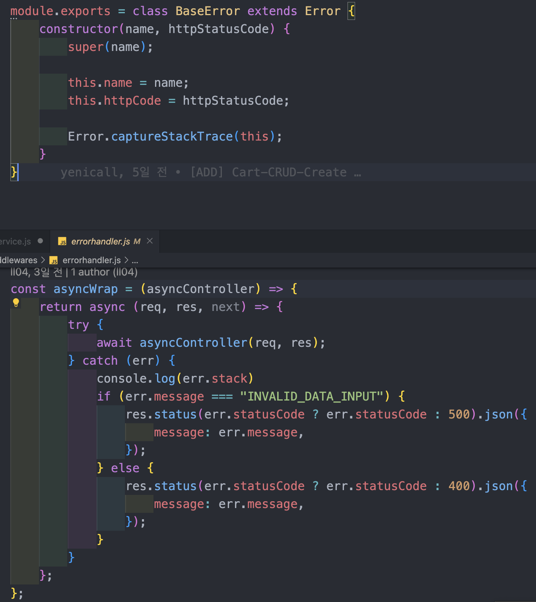

# 1차 프로젝트 회고록

기간 : 2022-08-16 ~ 2022-08-26 (11일)

사이트 : [이솝](https://www.aesop.com/kr/)

팀명 : 우솝

[FRONTEND GITHUB](https://github.com/wecode-bootcamp-korea/36-1st-Usopp-frontend)

[BACKEND GITHUB](https://github.com/wecode-bootcamp-korea/36-1st-Usopp-backend)

---

# Facts

## 프로젝트 팀 구성
- FRONT END 3명
- BACK END 3명

## 기술 스택

- FRONT END

`HTML`, `CSS`, `SASS`, `Javascript`, `React`

- BACK END

`Javascript`, `Node.js`, `express`, `MySQL`, `bcrypt`, `jwt`

- community tool

 `slack`, `Trello`, `Zoom`, `Gather`, `ngrok`

## 내가 맡은 부분

- DB 모델링
- 이메일 중복 체크
- 로그인
- 회원가입
- 에러핸들링
- 아로마의 종류에 따른 제품 출력

## 구현 사항

### DB 모델링

- DB 모델링은 동료들과 같이 정리하고 구조를 짜서 작성하였고 최종적으로 멘토님의 피드백이 반영되어 다음과 같은 구조를 갖게 되었다.

### 이메일 중복 체크

클라이언트에서 요청으로 email이 담겨오면 DB에 email이 존재하는지 여부를 판단해서 1이면 중복이라는 메시지, 0이면 존재하지 않는다는 메시지를 반환하도록 구현 하였다.

### 로그인

유저가 로그인을 할 때 이메일이나 패스워드 둘 중 하나가 다르면 보안상 하나가 다르다고 알려주면 안된다고 해서 에러메시지를 둘 중 하나가 다르다라고 응답했다.
그리고 나중에 사용 할 유저의 아이디와 이메일을 토큰에 담아서 발급할 수 있도록 페이로드에 담아서 토큰을 발행하는 로직을 구현했다. 

### 회원가입

이메일이 중복일 경우 중복메시지를 반환하고, 패스워드를 저장할 때 bcrypt를 이용해서 암호화해서 저장할 수 있도록 구현 했으며, 이메일과 패스워드는 우리 사이트에 맞게 정규표현식을 사용하여 검증하는 단계를 두었다.

#### 이메일 패스워드 정규 표현식

### 에러핸들링

controller, service, dao에서 나타나는 에러를 모아서 처리해 줄 수 있는 에러핸들링을 middleware에 구현 하였다.

### 아로마 타입에 따른 제품 출력

원래 계획은 사이트에 아로마가 쭉 나열되어 있고 중복 선택을 통해 그에 맞는 제품이 나타나도록 구현하려고 했지만, 프론트와의 통신과 멘토님 코드리뷰에 따른 수정사항을 처리하다보니 제 역할을 수행할 수 있는 필터를 구현하는데 실패하였다. 해당 부분은 좀 더 고민하고 공부해서 2차 프로젝트에 필터기능이 모든 사이트에 있어서 구현하도록 해봐야겠다.

# Feelings

정말 짧다면 짧고 길다면 짧은 2주가 순식간에 지나갔다. 우리 팀에는 코로나에 걸린 동료가 2분이 있어서 처음에는 소통에 큰 벽이 생길거라고 생각이 들었고 실제로 zoom을 이용해서 해보니 40분 제한 때문에 흐름이 계속해서 끊겨서 고생을 했지만, 게더타운을 알게되어 게더를 이용해서 소통을 하니 그 이후에는 큰 어려움은 없었다. 통신도 ngrok을 이용해서 재택하는 동료와 하니 소통에는 큰 어려움 없이 프로젝트를 진행했다. 

다만, 아쉬운 점이 있다면 백끼리의 소통은 원활하게 진행이 되었지만 프론트와의 소통이 잘 안되어서 아쉬웠다. 프로젝트가 처음 시작됐을때 프론트분들이 데이터 구조에 대해 질문을 줬었는데, 백에서 테이블 구상이 되지 않았던 때라 제대로된 답을 주지 못했고 그로 인해 나중에 고쳐야 할 점이 많아졌었다. 그리고 구현하고자 목표했던 기능들 중 주문과 필터, 검색 부분을 구현하지 못했다. 개인적인 역량도 부족했고 프로젝트를 진행하면서 생각보다 많은 에러를 마주하였고 서버가 터져서 고치는데도 시간이 많이 걸렸었다.

첫 팀 프로젝트를 진행하면서 내 역할을 해낼 수 있을까 걱정과 생각을 많이 했지만 옆에서 동료들과 같이 으쌰으쌰해서 잘 해낼 수 있었다. 이제 당장 내일이면 2차 프로젝트가 시작하지만, 1차 프로젝트보다 더 잘할 수 있겠다는 생각이 든다. 2차 프로젝트에서는 1차 프로젝트에서 해내지 못한 기능들과 어수선한 코드들을 좀 더 깔끔하고 좋은 방식으로 접근해서 더 나은 결과물을 만들어내고야 말겠다!
# Findings

### 개발의 재미 그리고 함께하는 즐거움

백엔드 수업과 과제를 진행하면서 1차 팀 프로젝트 시작 전 까지 혼자서 다 하는 식이었다. 그래서 첫 팀 프로젝트이자 1차 프로젝트였고 진행을 하면서 개발이, 소통이 그리고 팀이라는것이 정말 좋다는걸 알게되었다. 마냥 같이해서 신나는게 아닌, 어떤 하나의 목표를 다 같이 가지고 그 목표를 향해 밤낮없이 치열한 싸움을 벌이는 그 상황이 너무 즐거웠다. 앞으로 2차 프로젝트를 넘어서 현업에 가서 일을 하면서 힘든 순간이 매번 찾아 오겠지만 처음 가졌던 이 마음을 되새기면서 진행한다면 어떠한 장애물도 극복할 수 있을 것이라 생각한다.

# Self Affirmation
> 지난날에 대한 후회는 금물! 앞으로 성장해나가는 내 자신을 바라보기!