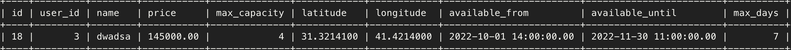

# 2차 프로젝트 회고록

기간 : 2022-08-29 ~ 2022-09-08 (11일)

사이트 : [AIRBNB](https://www.airbnb.com/)

팀명 : WeNB

[FRONTEND GITHUB](https://github.com/wecode-bootcamp-korea/36-2nd-WeNB-frontend)

[BACKEND GITHUB](https://github.com/wecode-bootcamp-korea/36-2nd-WeNB-backend)

[프로젝트 시연 영상]()

---

## 프로젝트 팀 구성
- FRONT END 4명
- BACK END 3명

---s

### 기술스택

- 프론트엔드 : 
  
  
  
  
  
  
  

- 백엔드 : 
  
  
  
  
  
  
  
  
  
  
  
  

- 협업 툴 :   

# Facts
## 내가 맡은 부분
- AWS S3를 이용한 이미지 업로더
- 카카오로그인을 통해 가입된 게스트 유저 호스트 등록 API
- 숙소 예약 시스템

### AWS S3를 이용한 이미지 업로더
클라이언트에서 이미지파일을 요청의 바디에 담아서 보내면 S3에 업로드 하는 로직을 미들웨어로 구현

위와 같이 입력을 해서 요청을 보낸뒤 응답을 보면

good!이 잘 찍혔다. 이제 AWS S3로 가서 확인을 해보자

### 유저의 호스트 등록 API

카카오 소셜 로그인을 통해 가입된 유저(게스트)가 호스트로 등록을 하면 유저의 타입이 1(게스트)에서 2(호스트)로 바뀌게 되며 email과 phone을 등록을 하고 email과 phone의 중복체크와 DB에 있는지 검증을 거쳐서 등록되게 된다.

먼저 데이터베이스에서 유저를 조회한 후 3번 유저가 호스트 등록을 한다고 가정하자.

클라이언트는 게스트의 토큰과 email, phone를 보내주면 미들웨어에서 토큰을 분해해서 userId를 빼서 바디에 같이 담아준다. 
이메일과 폰번호가 정상적으로 들어오게 되면 호스트 등록이 완료된다.

이제 DB에 저장된 값을 찾아보면 3번 유저의 타입은 2로 바뀌었고 이메일과 패스워드가 잘 들어온 것을 볼 수 있다.

### 숙소 예약 API
게스트or호스트가 숙소를 예약하기 위해 숙소를 선정한 후 날짜를 선택하고 예약 인원을 설정하면 숙소에 등록되어 있는 정보들을 가져와서 비교한 후 예약이 성공 OR 실패된다.

먼저 숙소의 정보를 보고

4번 유저가 해당 숙소를 보고 인원수랑 렌트 기간을 설정하고 렌트를 하면 성공적으로 예약된다.

이제 예약DB를 보면 다음과 같이 성공적으로 예약이 들어온것을 볼 수 있다.

# Feelings
2차 프로젝트가 마무리 되었다. 이번 2차 프로젝트에는 변수가 많았다... 화재에 갑자기 초강력이 되버린 태풍에 추석.. 이로 인해 정말 온전히 개발에 집중할 수 있는 시간이 계획했던 시간보다 적어지게 되었다. 그래도 역시 개발자는 온라인으로도 근무가 가능하기에 소통의 불편함은 없었다. 

2차 프로젝트를 마무리 하면서 좋았던 점, 아쉬웠던 점에 대해 이야기 해 보자면 먼저 좋았던 점은 1차 프로젝트 때 정말 많이 부실 했던 프론트와 백 간의 소통이 이번 2차 프로젝트에서 정말정말 잘 소통 되었다는 점이다. 이로 인해 서로 통신하면서 큰 에러 없이 잘 맞춰나갈 수 있었다! 그리고 저번 프로젝트에서 해보지 못한 기능을 맡아서 했는데, 소셜로그인 기능을 해보지 못해서 아쉽긴 하지만 그래도 AWS의 S3도 사용해 보고 다양한 패키지를 알게되고 사용해봐서 만족스럽다. 

아쉬운 점으로는 테스트 코드를 작성할 때 테스트를 위한 데이터를 테스트 시작하면서 만들어지고 테스트가 끝나면 디비에서 삭제가 되는 방식으로 작성을 했어야 했는데, 그러지 못하고 내가 임시로 만들어 놓은 목데이터를 이용하여 테스트를 돌려서 각각의 테스트들이 독립적이지 못한 관계가 되었다. 테스트코드는 신입개발자가 입사해서 봤을 때 어떤 로직을 가지고 있는지 파악을 해야하기 때문에 각각의 테스트들이 독립적이어야 한다. A라는 테스트가 C, F라는 테스트에 영향을 주다보니 A가 실패하면 C, F도 같이 실패가 되어서 정확한 문제점을 찾는데 시간이 걸렸다. 그리고 유닛테스트만 진행했고 통합 테스트와 e2e 테스트는 진행하지 못해서 아쉬웠다.

2차 프로젝트도 끝났고 협업할 기업도 나왔고 이제 출근만 앞두고 있다. 추석 덕분에 협업에 나가기까지 1주일 이라는 시간이 있어서 정말 다행이다. 그동안 지친 몸과 마음을 달래주고 배운것을 되돌아보고 새롭게 바뀌는 환경들에 맞춰 계획을 세워야겠다.

# Findings
### 함께 일하고 싶은 개발자
같은 프로젝트 팀이 된 두분의 백엔드 개발자분들과 같이 일을 하면서 정말 많은 것을 배웠다. 우선 한분은 소통을 정말 잘 해주셨고 일의 분배나 프로젝트에 필요한 다양한 툴의 양식(api문서, trello 등)들을 정말 깔끔하게 잘 작성해주셨다. 다른 한 분은 뒤에서 정말 묵묵히 맡은 일을 정말 잘 해주셨는데, 단순히 잘 해주신게 아니라 코드를 작성하고 리팩토링 하고 또 리팩토링하고 최대한 다른 사람이 편하도록 코드를 잘 짜주셔서 코드를 합쳤을 때 문제 없이 아주 잘 작동되었다. 두 분과 같이 일을 하면서 배울점도 많았고 진짜 같이 일하고싶은 사람들이 이런 분들이구나를 알게되어 기술적인 측면 뿐만 아니라 커뮤니케이션 측면에서도 한 층 성장할 수 있는 길을 발견하게 되었다.

# Self Affirmation
> 나는 성장의 재미로 살아간다.