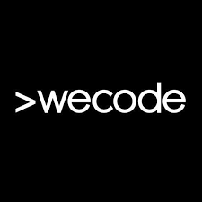

# 함께해서 wecode!

> 사전 스터디 : 2022-06-08 ~ 2022-07-17\
> 프리 코스 : 2022-07-18 ~ 2022-7-31\
> 파운데이션 : 2022-08-01 ~ 2022-08-14\
> 1차 프로젝트 : 2022-08-16 ~ 2022-08-26\
> 2차 프로젝트 : 2022-08-29 ~ 2022-09-08\
> 기업 인턴십 : 2022-09-19 ~ 2022-10-13\
> 위코드 수료식 : 2022-10-14

# 나는 누구인가?

나는 식품영양학과를 졸업했고 이전에는 프랜차이즈 회사 주방에서 그리고 반려동물 회사에서 신제품 연구와 생산, 물류, 재고관리, 기계조작 등의 업무를 맡아서 했다. 회사 생활을 하면서 내가 세상으로부터 도태되고 있구나를 느끼게 되었다. 세상은 빠르게 발전하고 있고 인간의 편의성을 높여주는 기술들이 매일 쏟아져 나오는 이 시대에 나는 매일 반복되는 루틴에서 나의 존재를 잊어가고 있었다. 원래 나는 어려서부터 호기심이 많았다. 어려서부터 걷는 걸 좋아했고 걸으면서 다양한 상상을 하는 것을 좋아했다. 그리고 고등학생 때는 발명 동아리에 들어서 다양한 대회에서 수상도 하고 창의력 올림피아드에서 한국 대표로 미국에 가기도 할 정도로 세상의 불편함을 찾고 개선하는 것을, 정말 엉뚱한 상상을 좋아했다. 그러나 지금의 나는 하루하루를 정말 무의미 하게 보내고 있었다. 그저 잠자고 일하고를 반복하는 로봇이 되었다. 3으로 앞자리가 바뀌게 되면서 정말 이렇게 살아서는 안된다고 생각을 했다. 20대 때 무언가를 열심히 한 것이 없었다. 그래서 30대에는 정말 달라지자고 생각을 했지만 20대의 10년간 굳어버린 나의 정신과 행동은 30살의 내가 하루아침에 바꾸기에 역부족이었다. 그냥 간절하지 못했나 보다. 그렇게 해가 바뀌게 되었고 이대로는 30대도 20대처럼 무의미 하게 지나갈 것 같아 두려웠다. 그래서 나는 사직서를 제출했다. 무엇을 하고 싶다고 생각하지 않았고 그저 이 정해진 현실을 깨고 싶었다. 그 첫째가 퇴사였다. 사직서를 제출했지만, 퇴사까지 2개월이라는 시간이 있었고 나는 무엇을 할지 생각했다. 나의 20대를 돌아보며 내가 무엇을 좋아했는지, 어떤 걸 하고 싶었는지 깊게 고민을 한적이 없었다는게 정말 한심하게 느껴졌고 부끄러웠다. 그렇게 10대로 거슬러 올라가 보니 10대 때 열정적으로 생활했던 것이 떠올랐다. 호기심이 왕성했고 상상력이 풍부했던, 성장의 기쁨으로 매일매일을 살아가던, 내 인생에서 가장 열심히 살았던 그 당시의 나를 생각하며 이 모든 것을 다시 한번 경험해 볼 수 있는 직업을 찾아보게 되었고 내가 찾은 정답은 개발자였다.

# 왜 개발자 인가?

`끊임없이 공부하고 생각하고 고민하고 상상하고 개선하는 모습`, 공부를 하면 할수록 그 성과가 나타나며 풀리지 않던 코드를 해결했을 때의 그 `성취감`, 그리고 마지막으로 `공유 문화`에 이끌렸다. 개발자라는 직업만큼 `성장과 발전`이라는 단어가 잘 어울리는 직업이 있을까 싶으며, 자신이 학습한 것을 아낌없이 나누고 자유로운 피드백을 통해서 다 같이 성장해나가는 학문이 또 뭐가 있을까 싶다. IT 업계가 빠른 성장을 이룬 이유도 이 공유 문화라고 생각한다.

성장을 위해 매일매일 공부를 하면서 어제보다 더 발전된 오늘의 나, 오늘의 나보다 더 성장해 있을 내일의 나를 생각하면 기분이 좋다. 요즘 그걸 절실히 느끼고 있다. 매일매일 새로운 문제를 마주하고 고민하고 해결하고 성장하는 나를 보며 1년 뒤에는 얼마나 더 성장해있을지 생각만으로도 동기부여가 확실히 되고 있다.

# 위코드에서

매일 반복되는 K 직장인의 루틴에서 벗어나 온전히 매일매일을 생각하고 고민하고 성장하기에만 초점을 맞출 수 있는 지난 위코드 생활은 정말 만족스럽다.

처음 위코드 본 과정 전에 사전 스터디를 하면서 팀장이라는 직책을 맡았다. 처음 해보는 스터디라 진행도 매끄럽지 못하고 너무 우유부단하게 행동했는데도 믿고 잘 따라와 준 팀원들에게 정말 감사하다.

사전 스터디를 진행하면서 나름대로 나만의 루틴을 정해서 진행했다. 그동안 불규칙적인 생활을 해왔고 책상 앞에 앉아 공부한 지가 오래되다 보니 이대로 위코드에 들어가면 큰일이 나겠구나 싶어서 일어나는 시간과 자는 시간, 오전과 오후에는 책상에 앉아 집중할 수 있는 시간을 점차 늘려갔다. 사전 스터디 기간 동안 100% 지키진 못했지만 그래도 어느 정도 루틴이 자리를 잡게 되었고 위코드 본 과정에는 위코드에 어떻게든 있으려고 허름하고 환경이 좋지 못한 정말 잠만 자기 위한 고시원을 잡아서 생활을 했다.

위코드 본 과정에 들어가서는 처음 한 달은 javascript와 git, node.js, express, mysql 등 을 배우고 5주 차에 1차 프로젝트를 시작했다. 프로젝트 시작 전에 정말 걱정을 많이 했지만 좋은 팀원들을 만나 그래도 내 역량을 최대한 발휘할 수 있었다고 생각한다. 다만, 첫 프로젝트이다 보니 아쉬운 점들도 많이 있었다. [1차 프로젝트](https://sw1104.github.io/Project/wecode-1st/)

7주 차에는 2차 프로젝트를 진행하였다. 2차 프로젝트에서는 1차 프로젝트에서 아쉬웠던 점들을 최대한 개선하기 위해 노력을 했으며, 커뮤니케이션이 능통한 동기와 연구 성향이 짙은 동기와 팀이 되어 같이 개발을 하면서 `함께 일하고 싶은 개발자`란 이런 사람들이구나를 배울 수 있었다. [2차 프로젝트](https://sw1104.github.io/Project/wecode-2st/)

10주 차에는 기업 인턴십을 진행했다. 스마트 시티, 금융 서비스, 무역금융, 헬스케어, 그린에너지 탄소거래, 탈 중앙화 신원관리(DID), 공급망 관리 등 다양한 분야에 블록체인 기술을 적용하는 기업에 인턴십을 나가게 되었고 내가 맡은 부분은 그린에너지 탄소거래 파트에 관리자와 사용자 대시보드 API 개발을 했다. 실제 기업에 나가 경험을 해보니 그동안 위코드에서 열심히 했다고 생각했는데, 회사 직원분들이 자기개발을 위해 출근 전에도 퇴근 후에도 자기개발을 위해 노력하시는 모습을 보면서 자극을 받았고 더욱더 열심히 해야겠다고 느꼈으며, 어떻게든 우리가 좋은 방향으로 성장할 수 있도록 도움을 주시고 자신들이 지금까지 경험하면서 느꼈던 점에 대해서 아낌없이 공유해 주시는 모습을 보면서 다시 한번 `개발자의 공유문화`의 위대함을 느낄 수 있었던 경험이었다. [기업 인턴십](https://sw1104.github.io/Project/cooperation/)

위코드에서 시작한 나의 개발자로서의 삶은 정말 좋은 선택이었다고 생각한다.

좋은 동기들, 훌륭한 매니저님들과 멘토님들, 위워크라는 좋은 환경 그리고 위코드라는 거대한 커뮤니티를 통해 정말 많은 경험을 했다. 위코드는 나에게 개발자로서의 방향성을 제시해 준 시작점과 같다. 위코드에서의 경험을 통해 나는 어떻게 생각하고 고민해야 하는지, 어떠한 자세로 소통을 해야 하는지 개발자의 기본 소양을 배울 수 있었다.

# 앞으로 나는

처음 개발자가 되고자 했을 때는 `잘 하는 개발자가 되고 싶다`라는 생각이 있었다. 하지만 위코드를 통해 나의 가치관이 바뀌게 되었다. 나만의 성장과 발전뿐만 아니라 옆에 있는 동료들의 성장과 발전에도 큰 기여를 할 수 있는 그리고 나중에는 많은 사람들에게 좋은 방향성을 제시해 줄 수 있는 그저 `잘 하는 개발자`가 아닌 `함께 하고 싶은 개발자`가 되는 것이 나의 다짐이자 목표이다.
