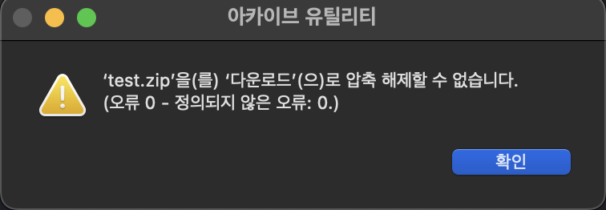

> 
 2022-11-28 ~ 2022-12-04 

---

## 이번 주에 한 일

#### 코딩테스트
- 8문제 풀이

#### catbow 라이브러리
- 동영상 이미지로 변환 후 압축
- 압축파일 S3 업로드
- 업로드 후 생성된 폴더와 파일들 삭제
- 원래 하나의 API로 동작하던 로직을 동영상 이미지 변환 후 압축 / S3업로드 후 해당 폴더 및 파일 삭제로 나누어 API 2개로 수정

#### 개생포 스터디
- 이력서 피드백
- 인성 면접 대비

#### 배겐드 스터디
- 기술 면접 대비

## 어려웠던 점

#### catbow 라이브러리

- 변환 된 이미지파일을 압축하는 과정에서 경로를 제대로 지정해주었지만 파일이 생성된 압축파일에 담기지 않아서 절대경로를 구해서 압축파일에 담기 까지 시간이 지체됨.
- 파일 압축까지 완료 후 S3에 업로드를 하고 S3를 통해서 다운받으니 압축 해제가 되지 않고 다음과 같은 에러가 발생

- 동영상을 이미지로 변환하는 로직, 이미지 파일을 압축하는 로직, 압축파일을 S3에 업로드하는 로직 총 3개의 기능을 각각 실행한 결과 작동이 되어서 하나의 API로 작동 되던 로직을 나눠서 2개의 API로 작동되게 변경 후 정상 작동 확인

## 느낀점 및 배운점

동기들과 진행한 리액트 라이브러리 개발에 필요한 `동영상 - 이미지 변환` 사이트 기능 구현을 마쳤다. 지난 주에 파일을 압축하는데 애를 먹었는데, 현재 경로를 절대경로로 변환한 뒤 해당 경로를 이용하여 압축 성공을 했다. 그러나 기쁨도 잠시 S3에 정상적으로 압축파일이 업로드 되었지만 다운 받아서 압축 해제를 하니 에러가 발생하여 처음에는 S3 업로드하는 방식에 문제가 있는 줄 알고 계속해서 찾아보며 로직을 수정하고 수정하고 수정했는데 전부 다 같은 에러를 맞이하였다. 그래서 천천히 접근해보기로 생각을 했고 문제점을 찾기 위해 다음의 방식으로 진행을 해보았다.

- 변환된 이미지를 직접 압축하고 S3업로드 로직을 이용해서 업로드 후 압축 해제 - 성공
- 변환된 이미지를 압축 로직으로 압축 후 S3에 직접 업로드 후 압축 해제 -  성공
- 하나의 기능만 두고 나머지를 주석처리 후 각각의 로직을 개별 진행 - 성공

여기까지 각각의 기능이 제대로 동작하는 것을 확인 하였다. 그래서 혹시나 각각의 기능들이 끝나고 바로 실행이 되어서 그런건가 하는 생각이 들어서 다음 방식으로도 해보았다.

- 기능과 기능 사이에 `time.sleep()`을 이용하여 시간 차이를 두고 진행 - 실패

여기까지 실험을 해본 뒤 문제는 압축파일을 만드는 기능과 S3에 업로드 하는 기능 사이에 무엇인가 있다는 생각이 들어서 둘의 로직을 분리하여 API를 따로 만들어서 진행을 해봤고 제대로 작동이 되는것을 확인하였다. 이 문제를 해결하려고 3일 내내 로직을 수정하고 수정하고 했는데 결과적으로는 로직들은 잘 돌아가고 있었고 분리를 해주면 되었는데 한번에 처리하려던 욕심 때문에 간단하게 해결할 수 있는걸 어렵게 끌고간거 같다. 그런데 다른 한편으론 각각의 로직이 잘 되는데 만나면 안되는건 로직이 제대로 안된게 아닌가 하는 생각이 들어서 이번 프로젝트가 얼추 마무리가 되면 파이썬에 대해 좀 더 알아보고 리팩토링이나 아예 더 좋은 로직으로 다시 구현을 해봐야겠다는 생각이 들었다. 

컴퓨터는 거짓말을 하지 않기 때문에 마음의 여유를 가지고 침착하게 차근차근 접근을 하면 풀리지 않는 문제는 없다는 것을 다시한번 깨닫게 되었다.