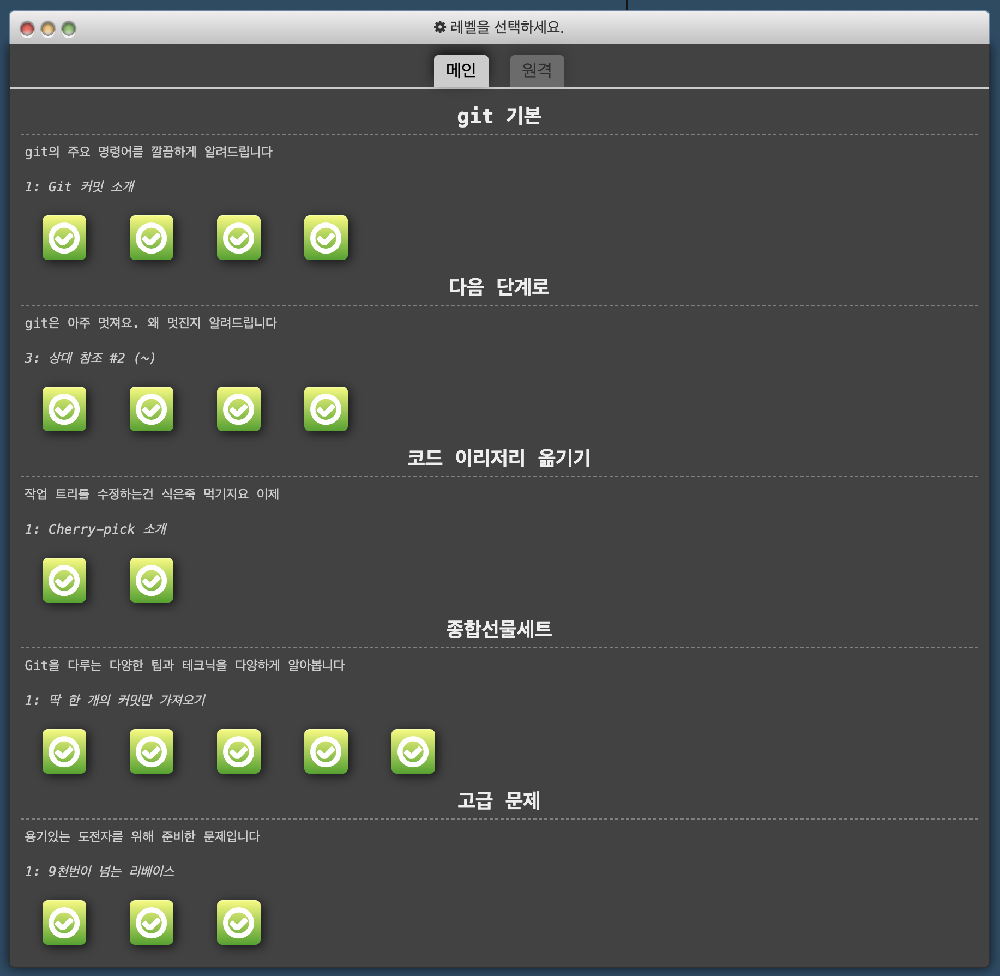

> 
 2023-01-09 ~ 2023-01-15 

---

## 이번 주에 한 일

- 프로그래머스 자바스크립트 광탈 방지 강의

- 깃허브 블로그 포트폴리오

- 깃 게임

- 원티드 프리온보딩 백엔드 챌린지

## 프로그래머스 자바스크립트 코딩테스트 광탈 방지 강의

지난 주 주말에 시작해서 계속 강의 듣고 풀이 하고 있는데 확실히 자료구조나 알고리즘을 아는것과 모르는것에 코테 문제를 해결하는데 많이 달라진 것을 느꼈다. 

## 깃허브 블로그 포트폴리오

깃허브 블로그에 Project 페이지를 만들어서 그동안 해온 프로젝트를 정리했다.

## 깃 게임

게임으로 배우는 깃이 있어서 한번 해봤다. 매일 사용하던 명령어였는데 딱 사용하는 기능만 알고 있다가 다른 방식으로도 풀 수 있단는 걸 알게돼서 도움이 많이 되었다.

[깃 게임](https://learngitbranching.js.org/?locale=ko)

## 원티드 프리온보딩 백엔드 챌린지

typescript와 nest를 공부하고 있었는데 마침 원티드에서 이 부분에 대한 강의를 진행해서 들었다. 강의는 총 4개로 3시간씩 2주에 걸쳐서 진행하는데, 가르치는 수준이 좀 높아서 따라가기가 버겁지만 열심히 한번 해보자!

