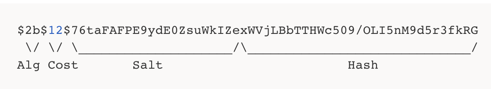

# Bcrypt
bcrypt는 브루스 슈나이어가 설계한 key 방식의 대칭형 블록 암호에 기반을 둔 암호화 해시 함수로 Niels Provos 와 David Mazières가 설계했다. Bcrypt는 레인보우 테이블 공격을 방지하기 위해 솔팅과 키 스트레칭을 적용한 대표적인 예이다.

## 구조

- Alg : 해시알고리즘 식별자
- Cost : Cost Factor로 Key Stretching의 수 (2의 12승번)
- Salt : 16Byte 크기의 Salt, Base64로 인코딩 된 22개의 문자
- Hash : 24Byte의 해시 값, Base64로 인코딩 된 31개의 문자

## 검증
Bcrypt는 단방향 해시 알고리즘 이다. 따라서 복호화가 불가능 하다. Bcrypt의 검증은 암호화된 값이 가지고 있는 알고리즘, Cost Factor, Salt를 이용한다. 비교하고 싶은 평문을 암호화된 값이 가지고 있는 알고리즘, Cost Factor, Salt를 이용하여 해시를 진행한 후 암호화된 값과의 비교를 통해 검증을 진행한다.

# Salting & Key Stretching
단방향 암호화에 사용되는 해시 알고리즘은 동일한 평문에 대해서 항상 동일 해시값을 갖는다. 따라서 특정 해시 알고리즘에 대해서 어떠한 평문이 어떠한 해시값을 갖는지 알 수 있다. 또한 본래 빠르게 데이터를 검색하기 위해 탄생이 되었기 때문에 공격자는 매우 빠른 속도로 임의의 문자열의 해시값과 해킹할 대상의 해시값을 비교하여 대상자를 공격할 수 있다.

이러한 문제를 보안하기 위해 단방향 암호화를 진행할 때 솔팅(Salting)과 키 스트레칭(Key Stretching)을 적용한다.

## 솔팅(Salting)
솔팅은 단방향 해시 함수를 통해 암호화를 진행할 때 본래 데이터에 추가적으로 랜덤한 데이터를 더하여 암호화를 진행하는 방식이다. 원래 데이터에 추가 데이터가 포함 되기 때문에 원래 데이터의 해시값과 다르다.

## 키 스트레칭(Key Stretching)
단방향 해시값을 계산한 후, 그 해시값을 다시 해시하고 또 이를 반복하는 방식이다. 최근에는 일반적인 장비로 1초에 50억 개 이상의 해시값을 비교할 수 있지만, 키 스트레칭을 적용하여 동일한 장비에서 1초에 5번 정도만 비교할 수 있다. GPU를 사용해도 수백에서 수천 번 정도만 비교할 수 있다.

# 정리

- 단방향 암호화는 해시 알고리즘을 기반으로 만들어졌다.
- 해시 알고리즘의 단점을 보완하기 위해 단방향 암호화에 솔팅(Salting)과 키 스트레칭(Key Stretching) 기술을 적용 한다.
- Bcrypt는 레인보우 테이블 공격을 방지하기 위해 솔팅과 키 스트레칭을 적용한 대표적인 예이다.
- crypt는 단방향 해시 알고리즘이기 때문에 복호화가 불가능 하다. 따라서 비교하고 싶은 평문을 암호화된 값이 가지고 있는 알고리즘, Cost Factor, Salt을 이용하여 해시를 진행한 후 암호화된 값과의 비교를 통해 검증을 진행한다.