프로젝트 배포를 위해 다음과 같이 frontend EC2 Instance는 `Public Subnet`에, backend EC2 Instance와 database는 `Private Subnet`에서 운용할 수 있도록 VPC를 생성할 것이다. 

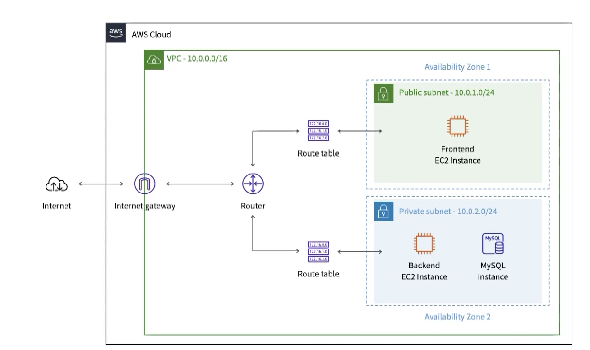

AWS에서 VPC 생성을 누르면 다음과 같이 VPC만 설치할건지 외에 것도 같이 설정할건지 나오는데 아직 미숙하기에 불필요한 리소스를 사용하게 될 수 있고 이는 곧 돈과 연결되기에 필요한 리소스를 직접 추가하고 제거하는 방법을 배우기 위해 VPC만 설치한다.

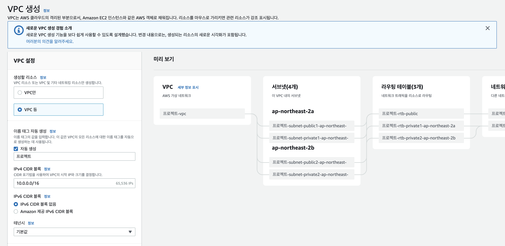

VPC 이름은 `DemoVPC`로 설정하고 VPC의 IP대역으로 사용할 IP는 `10.0.0.0/16`으로 입력한다.

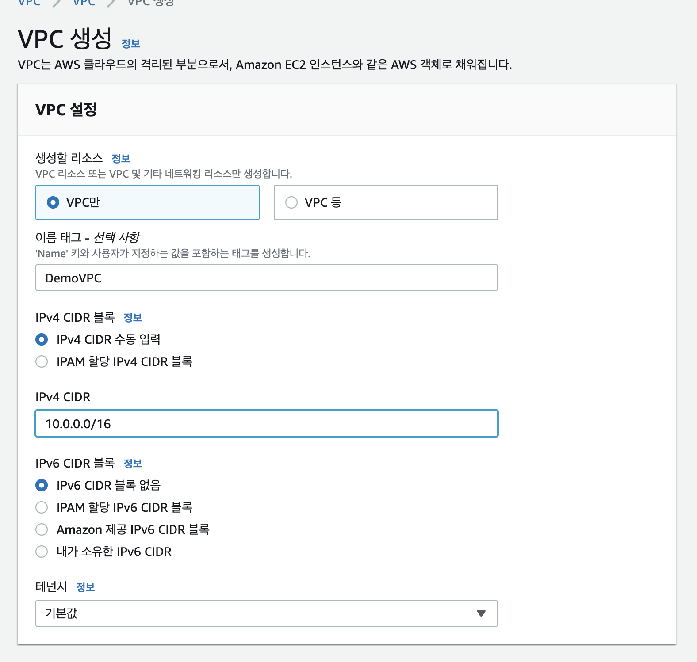

VPC가 생성이 끝났으면 다음은 서브넷 생성을 한다. 서브넷 생성에서 VPC는 방금 만들어둔 DemoVPC를 선택하고 서브넷 이름은 시멘틱하게 `Public Subnet`으로 지어준다. 가용 영역은 현재 리전에 포함되어있는 가용 영역 중 하나를 선택하면 되고 나는 `a`를 선택했다. 마지막으로 서브넷의 IP대역은 VPC의 IP대역에 포함되야 하기 때문에 그에 맞게 입력해준 뒤 서브넷을 생성한다.

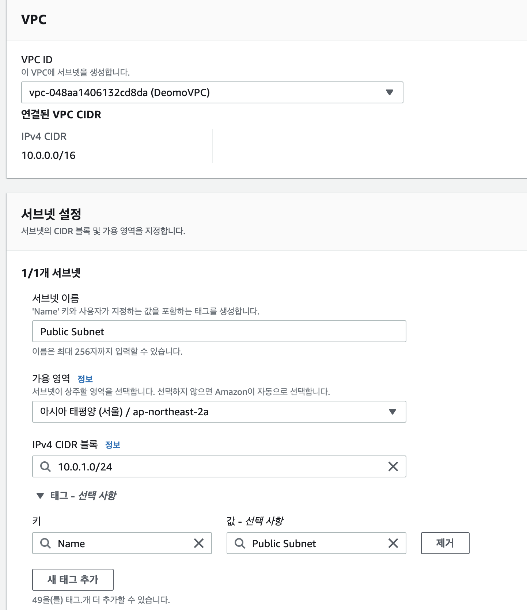

다음은 서브넷을 퍼블릭하게 동작할 수 있도록 하는 인터넷 게이트웨이 생성이다.
이름은 `demo-ig`로 하고 생성한다. 

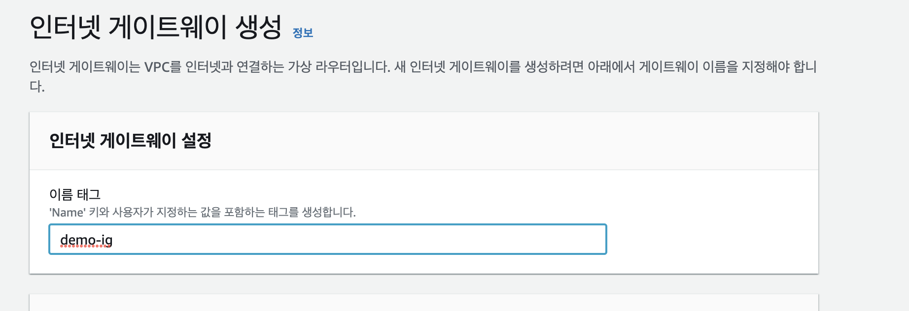

다음 생성된 인터넷 게이트웨이를 VPC와 연결해주는 작업이 필요하다. 오른쪽의 작업을 눌러서 VPC에 연결을 클릭한다.

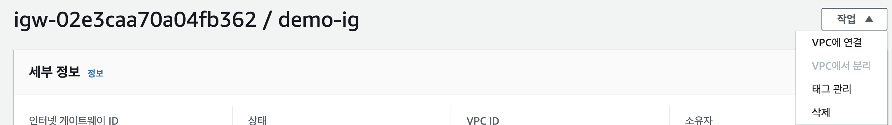

연결할 VPC를 선택하고 저장해주면 된다.

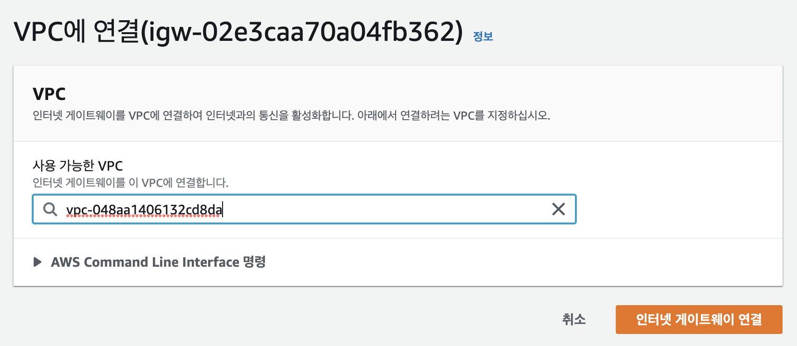

이제 라우팅 테이블을 생성한다. VPC를 생성하면 기본적으로 메인 라우팅 테이블이 생성이 되는데, 새로 생성한 서브넷들은 자동적으로 이 메인 라우팅 테이블과 연결되게 된다. 그렇지만 나는 배우는 입장이기에 이 메인 라우팅 테이블은 사용하지 않고 직접 사용할 라우팅 테이블을 생성할거다.

따라서 라우팅 테이블 생성을 누른 뒤 이름은 시멘틱하게 작성하고 VPC는 `DemoVPC`를 선택한 뒤 생성한다.

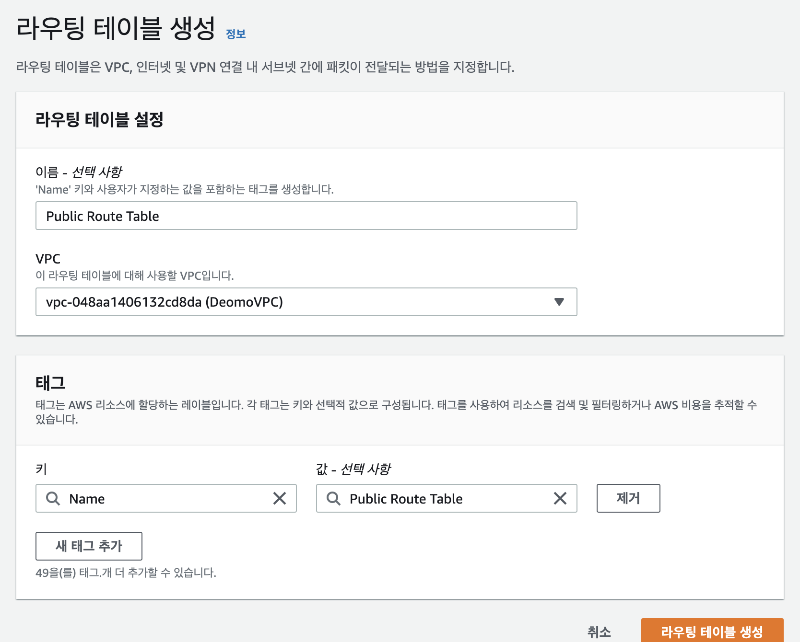

이제 생성한 라우팅 테이블과 서브넷을 연결해주어야 한다. 앞에서 생성했던 서브넷인 `Public Subnet`에서 오른쪽의 작업을 클릭한 뒤 라우팅 테이블 연결 편집을 눌러 방금 생성한 라우팅 테이블을 선택한 뒤 저장해준다.

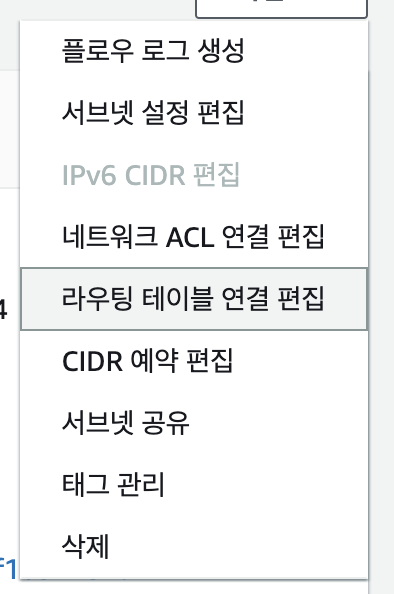

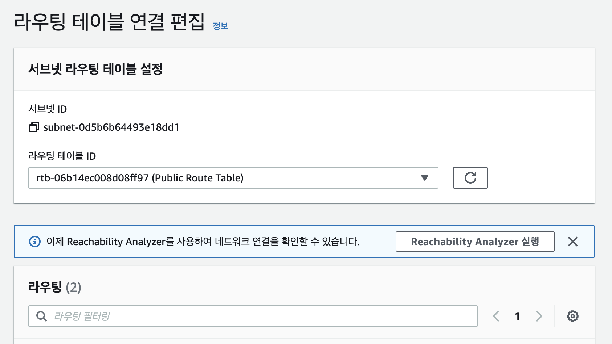

위와 같은 방식으로 이번에는 `Private Subnet`을 생성한 뒤 라우팅 테이블 `Private Route Table`을 만들고 연결해준다.

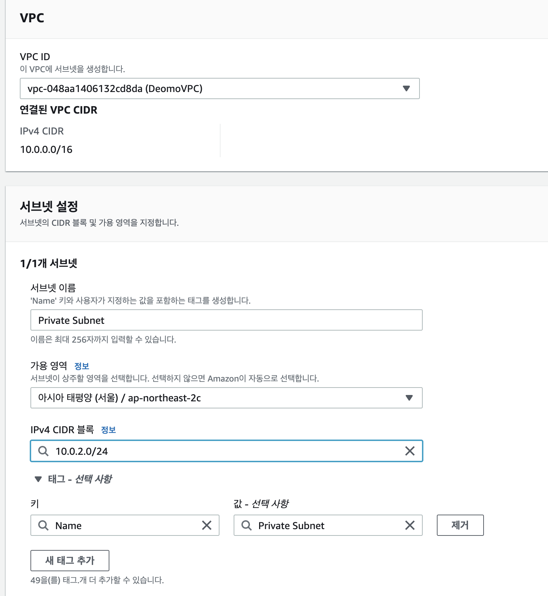

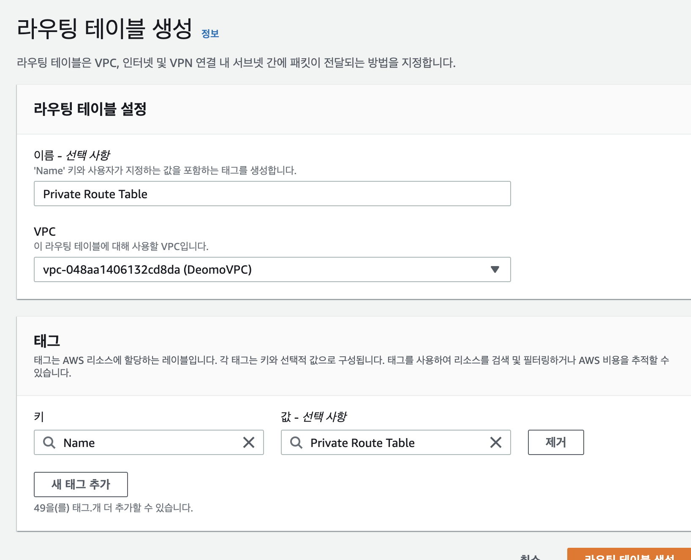

이제 다음은 backend EC2 Instance를 `Private Subnet`에서 운용하기 위해서는 프로젝트에 필요한 패키지를 설치하거나 깃허브에서 소스코드를 가져오는 등 외부로 통신할 수 있어야 하기 때문에 NAT Gateway가 필요하다. NAT Gateway는 시간 요금 및 처리하는 데이터 기가바이트 당 요금이 부과되기에 최소한의 비용으로 최선의 선택을 해야한다. 
