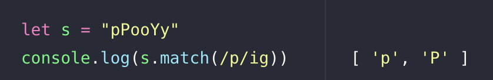

# 문제 설명

대문자와 소문자가 섞여있는 문자열 s가 주어집니다. s에 'p'의 개수와 'y'의 개수를 비교해 같으면 True, 다르면 False를 return 하는 solution를 완성하세요. 'p', 'y' 모두 하나도 없는 경우는 항상 True를 리턴합니다. 단, 개수를 비교할 때 대문자와 소문자는 구별하지 않습니다.

예를 들어 s가 "pPoooyY"면 true를 return하고 "Pyy"라면 false를 return합니다.

# 제한사항

문자열 s의 길이 : 50 이하의 자연수
문자열 s는 알파벳으로만 이루어져 있습니다.

# 입출력 예

|s|	answer|
|---|---|
|"pPoooyY"|	true|
|"Pyy"|	false|

# 입출력 예 설명
# 입출력 예 1
'p'의 개수 2개, 'y'의 개수 2개로 같으므로 true를 return 합니다.

# 입출력 예 2
'p'의 개수 1개, 'y'의 개수 2개로 다르므로 false를 return 합니다.

※ 공지 - 2021년 8월 23일 테스트케이스가 추가되었습니다.

# 문제 풀이

```javascript
function solution(s){
	let sl = s.toLowerCase()
	let arr = sl.split('')
	let p = [];
	let y = [];
	for(let i=0; i < arr.length; i++){
	    if(arr[i] === 'p'){
	        p.push(arr[i])
	    } else if(arr[i] === 'y'){
	        y.push(arr[i])
	    }
	}
	if(p.length === y.length){
	    return true
	} else if(p.length !== y.length){
	    return false초
	}
}
```

대소문자의 구별을 없애기 위해 먼저 `toLowerCase()`를 이용해서 인자로 받은 문자를 소문자로 만들어준 다음 `split()`을 이용하여 배열에 하나씩 넣어주었다. 그리고 `p`와 `y`가 담길 빈 배열을 선언한 뒤, for문과 조건문을 이용해서 배열에서 `p`와 `y`를 위에서 선언한 빈 배열에 담아준 뒤 조건문으로 둘의 `length`를 비교하여 풀이하였다.

# 다른 사람 풀이
```javascript
const solution = s => return s.match(/p/ig)?.length === s.match(/y/ig)?.length
```

다른 사람의 풀이를 보다가 감동?을 받은 풀이법을 발견했다.`match` 메소드는 주어진 문자열이 정규식과 매치가 되는지 확인하는 메소드다. `match` 메소드를 이용해서 인자로 받은 s라는 문자열 안에 `p`값이 있는지 없는지 정규식을 이용해서 확인한 뒤 `length`로 배열의 길이를 가져와서 비교하는 것이다. `match`와 정규식 `/p/ig`를 사용하면 다음과 같이 나타난다.



정규표현식의 `p`는 말 그대로 문자 `p`를 의미하고 `i`는 대문자, 소문자 상관 없이 찾는걸 뜻하고 `g`는 배열 전체를 의미한다. 

`?`를 붙여주는 이유는 `p`와 `y`가 모두 없을 경우를 위해서 존재한다.

`?`를 적지 않을 경우 빈 배열은 `null` 값이 되어 `length`를 쓸 수 없어 타입에러가 나타난다.


`?`를 적어줘야 undefined가 되어 `p`와 `y`를 비교할 수있게 된다.

